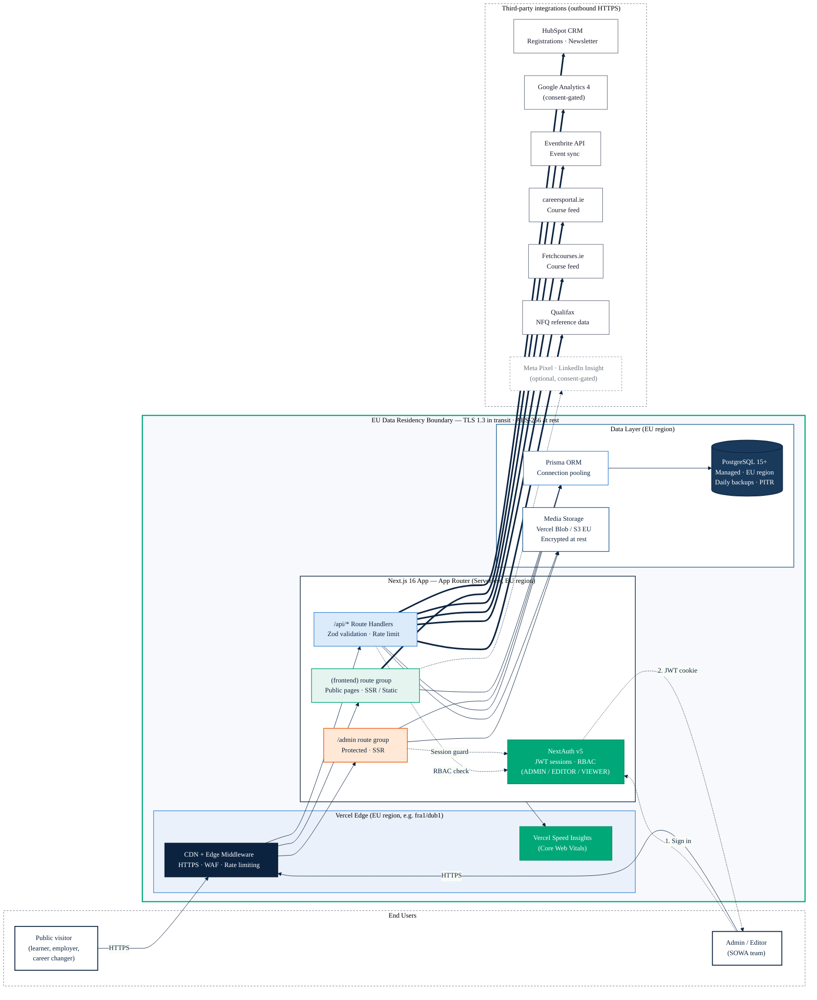

# System Architecture

## Deployment Diagram

The diagram below is the canonical reference for the production topology used in the tender submission. Source: [`diagrams/architecture.mmd`](diagrams/architecture.mmd). Exports for the tender PDF live at [`diagrams/architecture.svg`](diagrams/architecture.svg) and [`diagrams/architecture.png`](diagrams/architecture.png) (A4 landscape, 300 dpi).



### Trust Boundaries

Three boundaries are enforced:

1. **Public internet → Vercel Edge.** All traffic is HTTPS (TLS 1.3), terminated at the Vercel edge. WAF and per-IP rate limiting run at the edge before any request reaches the application.
2. **Edge → EU data residency boundary.** The Next.js functions, Postgres and media storage are all provisioned in an EU region (e.g. Frankfurt `fra1` or Dublin). No personal data leaves the EU boundary except through explicit, consent-gated integrations listed below.
3. **Application → Third-party integrations.** Every outbound integration is an HTTPS call from server-side route handlers (never browser-direct), keeping API secrets off the client. Analytics and marketing pixels are the only client-side calls, and they are gated by the cookie consent banner.

### Security & Compliance Notes (cross-referenced with the diagram)

| Concern                 | Control                                                                                                                                                  |
| ----------------------- | -------------------------------------------------------------------------------------------------------------------------------------------------------- |
| Encryption in transit   | TLS 1.3 for all public traffic and all outbound integration calls. HSTS enabled at the edge.                                                             |
| Encryption at rest      | Managed Postgres and object storage both use AES-256 at rest (provider-managed keys).                                                                    |
| EU data residency       | Vercel serverless functions, Postgres (Neon / Supabase / RDS), and media (Vercel Blob / S3) are all pinned to an EU region.                              |
| Backups                 | Managed Postgres provides daily automated backups and point-in-time recovery (PITR) for a minimum 7-day window.                                          |
| Rate limiting           | Applied at the edge (coarse) and in `/api/*` route handlers (fine, per-identity) via the limiter in `src/lib/rate-limit.ts`.                             |
| AuthN/AuthZ             | NextAuth v5 with JWT sessions. Role-based access (`ADMIN` / `EDITOR` / `VIEWER`) enforced in middleware for `/admin/**` and in each protected API route. |
| Consent-gated analytics | GA4, Meta Pixel and LinkedIn Insight Tag only load after the user grants the corresponding consent category in the `sowa_consent` cookie.                |
| Secrets                 | All integration keys (HubSpot, Eventbrite, Qualifax, feed APIs) live in Vercel environment variables and are only readable by server functions.          |

## Tech Stack

| Layer         | Technology                 | Version       | Rationale                                                                                                  |
| ------------- | -------------------------- | ------------- | ---------------------------------------------------------------------------------------------------------- |
| Framework     | Next.js                    | 16.2.2        | App Router with server/client component model, SSR for SEO, API routes for backend, single deployable unit |
| Language      | TypeScript                 | 5.x           | Strict mode. Type safety across frontend and backend reduces runtime errors                                |
| Runtime       | React                      | 19.2.4        | Server Components for data-heavy pages, Client Components only where interactivity is needed               |
| Styling       | Tailwind CSS               | 4.x           | Utility-first CSS with design tokens. Consistent theming, no CSS-in-JS runtime overhead                    |
| Database      | PostgreSQL                 | 15+           | Relational model fits the structured content domain. JSONB for flexible diagnostic scoring                 |
| ORM           | Prisma                     | 7.6.0         | Type-safe database access, auto-generated client, migration management, visual studio                      |
| Auth          | NextAuth.js                | 5.0.0-beta.30 | JWT sessions, credentials provider, role-based middleware. Integrates natively with Next.js                |
| Forms         | React Hook Form + Zod      | 7.72 / 4.3    | Performant form handling with schema-based validation shared between client and server                     |
| Rich Text     | TipTap                     | 3.22.1        | Extensible ProseMirror-based editor for admin content editing                                              |
| Visualisation | @xyflow/react (React Flow) | 12.10.2       | Interactive node-based career pathway maps                                                                 |
| Charts        | Recharts                   | 3.8.1         | Radar charts for diagnostic skill assessment results                                                       |
| Icons         | Lucide React               | 1.7.0         | Tree-shakeable SVG icon library. Consistent line-icon style                                                |
| Utilities     | clsx + tailwind-merge      | 2.1 / 3.5     | Conditional class names with Tailwind conflict resolution via `cn()` helper                                |

---

## Component Architecture

```
┌─────────────────────────────────────────────────────────┐
│                    Next.js App Router                     │
├──────────────────────┬──────────────────────────────────┤
│   (frontend) group   │          admin group              │
│   Public pages       │   Authenticated CMS pages         │
│   Server Components  │   Client Components + forms       │
│   SSR / Static       │   JWT session guard               │
├──────────────────────┴──────────────────────────────────┤
│                    API Routes (/api/*)                    │
│   Rate-limited  │  Auth-guarded  │  Zod-validated        │
├─────────────────────────────────────────────────────────┤
│              Library Layer (src/lib/)                     │
│   queries.ts  │  validations.ts  │  auth.ts  │  utils.ts│
├─────────────────────────────────────────────────────────┤
│                Prisma ORM (schema.prisma)                 │
├─────────────────────────────────────────────────────────┤
│                    PostgreSQL                             │
└─────────────────────────────────────────────────────────┘
```

### Route Groups

- **`(frontend)`** — Public-facing pages. Uses a shared layout with `Header` and `Footer`. Pages are server components by default, with `'use client'` only for interactive elements (pathway map, diagnostic quiz, filters, search).
- **`admin`** — CMS pages behind authentication. The admin layout checks the NextAuth session and redirects unauthenticated users to `/admin/login`. Includes sidebar navigation and top bar.

### Component Hierarchy

```
src/components/
├── ui/              # Design system primitives (Button, Card, Badge, Input, etc.)
├── layout/          # Header, Footer, MobileMenu, Breadcrumbs, CookieConsent
├── home/            # Homepage sections (Hero, AudienceCards, StatsBar, etc.)
├── careers/         # CareerCard, PathwayMap (React Flow), MiniPathway, SkillBadge
├── courses/         # CourseCard, FilterPanel, FilterDrawer, FilterChips
├── events/          # EventCard
├── research/        # ResearchCard
├── diagnostic/      # QuestionStep, ProgressBar, ResultsChart, GapCard
├── registration/    # RegisterButton, RegistrationModal
└── admin/           # Sidebar, Topbar, DataTable, form components, RichTextEditor
```

---

## Data Flow

### Public Page Request

```
Browser → Next.js Server Component
           ↓
         queries.ts (getAllCareers, getFilteredCourses, etc.)
           ↓
         Prisma Client
           ↓
         PostgreSQL
           ↓
         HTML response (SSR)
```

### Admin Content Edit

```
Admin Browser → Client Component (React Hook Form)
                  ↓ (fetch)
                API Route (/api/careers)
                  ↓
                Auth middleware (requireAuth + requireRole)
                  ↓
                Zod validation (parseBody)
                  ↓
                Rate limiter check
                  ↓
                Prisma Client (create/update)
                  ↓
                Content versioning (createContentVersion)
                  ↓
                PostgreSQL
                  ↓
                JSON response → UI update
```

### Diagnostic Assessment

```
Browser → /diagnostic/assessment (Client Component)
            ↓
          GET /api/diagnostic/questions → Fetch all questions
            ↓
          User answers questions (client state)
            ↓
          POST /api/diagnostic/results { answers: {...} }
            ↓
          Server: calculateResults() in diagnostic.ts
            - Fetch skills, careers, courses from DB
            - Score answers against skill weightings
            - Identify gaps (high/medium/low severity)
            - Match interests to careers
            - Recommend courses to fill gaps
            ↓
          Return { scores, gaps, recommendedCareers, recommendedCourses }
            ↓
          ResultsChart (Recharts radar) + GapCards + RecommendationCards
```

### Registration Flow

```
Public User → RegisterButton → RegistrationModal
                ↓
              POST /api/registrations
                - Validate with Zod (registrationSchema)
                - Check event capacity (count active registrations)
                - Create registration with GDPR consent flag
                ↓
              Admin → GET /api/admin/registrations (paginated, filterable)
                ↓
              Admin → PATCH /api/admin/registrations/[id] (confirm/cancel)
                ↓
              Admin → GET /api/admin/registrations/export (CSV download)
```

---

## Content Publishing Workflow

```
  DRAFT ──────→ IN_REVIEW ──────→ PUBLISHED
    ↑               │                  │
    └───────────────┘                  │
    (rejection with note)              ↓
                                   ARCHIVED
```

- **EDITOR** can move: DRAFT → IN_REVIEW
- **ADMIN** can move: any transition, including scheduled publishing (set `publishAt` for future date)
- Auto-publish: A PUT endpoint on `/api/content-status` checks for items where `publishAt <= now()` and transitions them to PUBLISHED
- Every status change creates a `ContentVersion` snapshot for audit

---

## Hosting Architecture

### Recommended: Vercel + Managed PostgreSQL

```
┌──────────────────────────────┐
│         Vercel Edge           │
│   CDN, SSL, Edge Middleware   │
├──────────────────────────────┤
│     Vercel Serverless         │
│   Next.js App (SSR + API)     │
│   Auto-scaling functions      │
├──────────────────────────────┤
│      Managed PostgreSQL       │
│   (Neon / Supabase / RDS)     │
│   Connection pooling          │
│   Automatic backups           │
└──────────────────────────────┘
         │
    ┌────┴────┐
    │  Media   │
    │ Storage  │
    │ (local/  │
    │  S3)     │
    └─────────┘
```

**Current state:** Media files are stored on the local filesystem under `public/uploads/`. For production, migrate to an object storage service (S3, Cloudflare R2, or Vercel Blob).

### Environment Requirements

- Node.js 18+ (LTS recommended)
- PostgreSQL 15+
- `DATABASE_URL` environment variable
- `NEXTAUTH_SECRET` for JWT signing
- `NEXTAUTH_URL` for callback URLs

### HubSpot CRM Integration

The platform includes a HubSpot integration layer (`src/lib/hubspot.ts`) for syncing registrations and newsletter subscriptions to a CRM. Currently **stubbed** — the functions log to console when `HUBSPOT_API_KEY` is not set.

```
Registration form   →  POST /api/registrations  →  Prisma (DB write)
                                                  →  syncRegistration() (HubSpot, non-blocking)

Newsletter form     →  POST /api/newsletter      →  syncNewsletterSubscription() (HubSpot)

Admin dashboard     →  GET /api/admin/hubspot/status  →  getSyncStatus()
```

To activate: set `HUBSPOT_API_KEY`, `HUBSPOT_PORTAL_ID`, and `HUBSPOT_NEWSLETTER_LIST_ID` environment variables, then implement the actual API calls in `src/lib/hubspot.ts` using the `@hubspot/api-client` package (already installed).

### External Data Feeds (course & qualification sources)

To keep the course directory and NFQ metadata current without double-keying, the admin CMS can ingest from three Irish sources via scheduled server-side jobs. All calls are outbound HTTPS from `/api/*` route handlers; credentials live in Vercel environment variables.

| Source               | Purpose                                                                          | Mode                     |
| -------------------- | -------------------------------------------------------------------------------- | ------------------------ |
| **Eventbrite API**   | Pulls SOWA-hosted events and writes them as draft `Event` rows for editor review | Scheduled sync + webhook |
| **careersportal.ie** | Reference feed for Irish career descriptors and labour-market signals            | Scheduled pull           |
| **Fetchcourses.ie**  | Authoritative feed of FET/HET courses to pre-populate `Course` drafts            | Scheduled pull           |
| **Qualifax**         | NFQ level reference data used to validate `Course.nfqLevel` on save              | On-demand lookup         |

Ingested records are always created in `DRAFT` status and routed through the standard editorial workflow (DRAFT → IN_REVIEW → PUBLISHED) so an SOWA editor approves anything that goes public.

### AI-Powered Career Summary

The diagnostic tool includes an optional AI summary feature:

```
POST /api/diagnostic/summary
  ↓
Feature flag: AI_SUMMARY_ENABLED=true
  ↓
Anthropic API (Claude Haiku, preferred) OR OpenAI API (GPT-4o-mini, fallback)
  ↓
Personalised ~200-word career guidance paragraph
```

### Analytics and Marketing Pixels

Consent-aware tracking is implemented in `src/lib/analytics.ts` and `src/lib/marketing-pixels.ts`:

- **GA4** — loads only after analytics consent. Typed event helpers for career views, course views, diagnostic completion, search, etc.
- **Meta Pixel** — loads only after marketing consent and `NEXT_PUBLIC_META_PIXEL_ID` is set
- **LinkedIn Insight Tag** — loads only after marketing consent and `NEXT_PUBLIC_LINKEDIN_PARTNER_ID` is set
- Cookie consent banner (`CookieConsent` component) manages preferences via a `sowa_consent` cookie

### SEO and Discovery

- **Dynamic sitemap** (`src/app/sitemap.ts`) — generates entries for all published careers, courses, events, research, and news
- **robots.txt** (`src/app/robots.ts`) — allows all crawlers, blocks `/diagnostic/assessment`
- **PWA manifest** (`src/app/manifest.ts`) — app name, icons, theme colour
- **OG image** (`src/app/opengraph-image.tsx`) — generated Open Graph image
- **Vercel Speed Insights** — Core Web Vitals monitoring via `@vercel/speed-insights`

### Performance Considerations

- Server Components reduce client-side JavaScript
- Prisma connection pooling via PrismaPg adapter
- In-memory rate limiting (swap to Redis for multi-instance deployments)
- Next.js Image optimisation for media
- Vercel Speed Insights integrated for monitoring

---

## Key Architectural Decisions

| Decision              | Choice                        | Alternative Considered          | Rationale                                                                                                                                                                                                                                                                                                                                                                                           |
| --------------------- | ----------------------------- | ------------------------------- | --------------------------------------------------------------------------------------------------------------------------------------------------------------------------------------------------------------------------------------------------------------------------------------------------------------------------------------------------------------------------------------------------- |
| Database              | PostgreSQL + Prisma           | Payload CMS + MongoDB, Supabase | Structured relational data model fits the career/course/skill/pathway domain, which has many cross-entity relationships. Prisma provides end-to-end type safety, migrations, and a familiar workflow. A headless CMS was considered and rejected: the content model is tightly constrained and relational, not free-form, so a custom admin UI on top of Prisma is a better fit than a generic CMS. |
| Auth                  | NextAuth credentials          | OAuth providers                 | Admin-only auth. Credentials provider is simplest for internal users. OAuth can be added later.                                                                                                                                                                                                                                                                                                     |
| Styling               | Tailwind CSS 4                | CSS Modules, styled-components  | Utility-first approach, design tokens in config, no runtime overhead, good DX with IDE support                                                                                                                                                                                                                                                                                                      |
| State management      | Server Components + URL state | Redux, Zustand                  | Most pages are server-rendered. Filter state lives in URL params. Client state only for modals and forms.                                                                                                                                                                                                                                                                                           |
| Rate limiting         | In-memory Map                 | Redis, Upstash                  | Sufficient for single-instance deployment. Redis recommended for production multi-instance.                                                                                                                                                                                                                                                                                                         |
| Rich text             | TipTap                        | Draft.js, Slate                 | Modern ProseMirror-based editor with good extension ecosystem. Outputs HTML for flexible rendering.                                                                                                                                                                                                                                                                                                 |
| Pathway visualisation | React Flow                    | D3.js, Cytoscape                | Purpose-built for node/edge diagrams with built-in pan, zoom, and interactivity                                                                                                                                                                                                                                                                                                                     |

---

## Third-Party Content Integrations

Per Appendix 1 §§ 313–323 of the tender, the platform is deliberately
systems-agnostic and architecturally capable of ingesting content from
external sources. Final scope (which sources go live, at what cadence) is
confirmed in the post-award kick-off workshop, as per Appendix 1 § 322.

### Named sources

- **Eventbrite** — events
- **careersportal.ie** — courses / career information
- **Fetchcourses.ie** — courses
- **Qualifax.ie** — accredited course records
- **Bespoke partner platforms** — events or courses, case-by-case
- **Future: eTenders** — opportunity notices (reserved)

Content created directly in the admin UI uses the `MANUAL` source and has
no adapter.

### Adapter pattern

Each source is a thin adapter implementing the `ContentSourceAdapter`
interface in `src/lib/integrations/types.ts`:

```ts
interface ContentSourceAdapter {
  readonly source: SourceId;
  readonly name: string;
  fetch(): Promise<NormalisedItem[]>;
}
```

Adapters live in `src/lib/integrations/` and are exposed through a typed
`registry.ts`. They own auth, pagination, and rate-limit compliance; they
do **not** own database writes, retry policy, or scheduling. Each adapter
returns a list of `NormalisedItem` records — a superset shape that maps
cleanly onto either the `Course` or `Event` Prisma model depending on
`kind`.

### Normalisation and upsert

The `Course` and `Event` Prisma models carry `source` (ContentSource enum,
default `MANUAL`) and `externalId` (nullable string) columns, with a
unique index on `(source, externalId)`. The sync runner upserts by this
compound key, so repeated syncs are idempotent and an item's identity is
stable across runs without depending on slugs or titles. Items authored
manually and items pulled from a feed coexist in the same tables and flow
through the same editorial status machine (`DRAFT → IN_REVIEW → PUBLISHED
→ ARCHIVED`).

### Error handling

The sync runner wraps each `fetch()` call with:

- **Retry with exponential backoff** — 3 attempts with jitter on transient
  5xx and network errors.
- **Per-source circuit breaker** — trips after sustained failure, isolates
  one bad source from the rest of the sync, auto-resets after a cool-down.
- **Structured logging** — request id, HTTP status, item count, duration,
  and error category, emitted to the platform's log pipeline.
- **Admin alerting** — email plus an ops channel notification on circuit
  trip or repeated failure, so a dropped feed is visible the same day.

Adapters themselves throw on genuine errors and resolve (possibly to `[]`)
on "no new content", so an empty day is not treated as a failure.

### Security

- Credentials are loaded from environment variables only, managed via the
  hosting provider's secret store. Nothing is hardcoded, committed, or
  logged.
- Outbound calls are restricted to an allowlist of documented source
  endpoints configured at the network layer.
- Rate limits are honoured per source (e.g. Eventbrite's 1000 req/hour/
  token); the sync runner paces requests and respects `Retry-After`.
- Every ingested item retains its source URL for attribution and audit.

### Current state

At time of writing, the `EVENTBRITE` adapter is registered as a stub — it
implements the interface and returns `[]` pending workshop scope. The
remaining sources (`CAREERSPORTAL`, `FETCHCOURSES`, `QUALIFAX`) are
reserved in the `SourceId` union and Prisma enum so adding them is a
one-file change. A vitest case in
`src/__tests__/lib/integrations.test.ts` asserts that every registered
adapter satisfies the interface contract.
