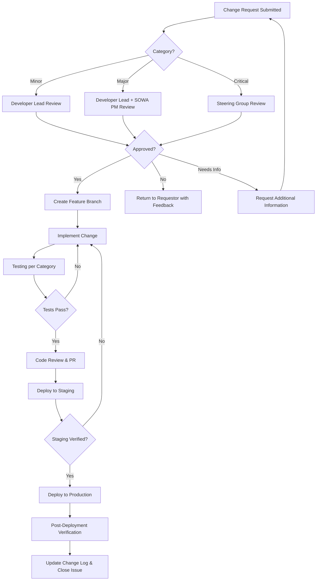

# Change Control Procedure

Scope: all changes to the SOWA OWE Platform codebase, infrastructure, and configuration. This document satisfies RFT Section 13.5 (documented change control procedure with stakeholder approval process).

---

## 1. Purpose & Scope

This procedure governs how changes to the SOWA platform are requested, assessed, approved, implemented, and documented. It applies to:

- Application code (frontend and backend)
- Database schema and migrations
- Infrastructure configuration (Vercel, Neon, DNS)
- Third-party integrations (HubSpot, analytics, AI providers)
- Security controls and environment variables
- Documentation and content structure

**Out of scope:** routine content updates (adding/editing careers, courses, events, research, news) managed through the CMS publishing workflow — see [Publishing Workflow](./publishing-workflow.md).

---

## 2. Change Categories

| Category     | Definition                                                                                          | Examples                                                                                        | Target Turnaround       |
| ------------ | --------------------------------------------------------------------------------------------------- | ----------------------------------------------------------------------------------------------- | ----------------------- |
| **Minor**    | Low-risk changes with no impact on data, security, or user-facing functionality                     | Copy corrections, style tweaks, dependency patch updates, documentation updates                  | 1–3 business days       |
| **Major**    | Changes that affect user-facing features, data models, integrations, or performance                 | New feature development, API changes, database migrations, third-party integration updates       | 5–15 business days      |
| **Critical** | Changes with significant risk to platform availability, data integrity, security, or compliance     | Security patches for active exploits, database schema changes affecting live data, auth changes  | Immediate–5 business days |

---

## 3. Change Request Process

### 3.1 Submission

All change requests are submitted as **GitHub Issues** in the `skillnet-owa/sowa-platform` repository using the **Change Request** issue template. The template captures:

| Field                    | Description                                                              | Required |
| ------------------------ | ------------------------------------------------------------------------ | -------- |
| **Title**                | Concise description of the proposed change                               | Yes      |
| **Category**             | Minor / Major / Critical                                                 | Yes      |
| **Description**          | Detailed explanation of what is being changed and why                    | Yes      |
| **Business Justification** | Why this change is needed — user need, compliance, defect, enhancement | Yes      |
| **Affected Components**  | Which parts of the system are impacted (frontend, API, database, infra)  | Yes      |
| **Impact Assessment**    | Scope, timeline, cost, and risk analysis (see §3.2)                     | Yes      |
| **Proposed Timeline**    | Requested implementation and deployment dates                            | Yes      |
| **Requestor**            | Name and role of the person requesting the change                        | Yes      |
| **Attachments**          | Screenshots, mockups, specifications, or related documents               | No       |

For urgent security issues, a change request may be submitted via email to the developer lead with a GitHub Issue created retrospectively within 24 hours.

### 3.2 Impact Assessment

Every change request must include an impact assessment covering:

| Criterion      | Assessment Questions                                                                                     |
| -------------- | -------------------------------------------------------------------------------------------------------- |
| **Scope**      | How many components/services are affected? Does the change touch the database schema?                    |
| **Timeline**   | How long will implementation take? Does it block other work? Is there a deadline?                        |
| **Cost**       | Does it require additional infrastructure, licensing, or third-party services?                           |
| **Risk**       | What could go wrong? What is the blast radius? Can the change be rolled back?                            |
| **Testing**    | What testing is required to validate the change? Are new tests needed?                                   |
| **Compliance** | Does the change affect GDPR compliance, accessibility (WCAG 2.2 AA), or security controls?              |
| **Users**      | Does the change affect end-user experience? Does it require communication to stakeholders?               |

---

## 4. Approval Workflow

### 4.1 Approval Matrix

| Category     | Approver(s)                                         | Approval Method              | SLA for Decision   |
| ------------ | --------------------------------------------------- | ---------------------------- | ------------------ |
| **Minor**    | Developer lead                                      | GitHub Issue approval comment | 1 business day     |
| **Major**    | Developer lead **and** SOWA project manager         | GitHub Issue approval + email | 3 business days    |
| **Critical** | Developer lead, SOWA project manager, steering group | Steering group meeting/email  | 1 business day     |

### 4.2 Workflow Diagram



### 4.3 Emergency Changes

For Critical changes requiring immediate action (e.g., active security exploit, platform outage):

1. Developer lead may implement and deploy the fix immediately
2. SOWA project manager is notified within 1 hour
3. Retrospective change request and approval are completed within 24 hours
4. Steering group is briefed at the next scheduled meeting or via email within 48 hours

---

## 5. Implementation Process

### 5.1 Branch Strategy

All changes follow a branch-based workflow on the `main` branch:

| Change Type       | Branch Naming Convention | Base Branch | Merge Target |
| ----------------- | ------------------------ | ----------- | ------------ |
| New feature        | `feature/<issue-number>-<short-desc>` | `main`      | `main`       |
| Bug fix            | `fix/<issue-number>-<short-desc>`     | `main`      | `main`       |
| Critical/hotfix    | `hotfix/<issue-number>-<short-desc>`  | `main`      | `main`       |
| Documentation only | `docs/<issue-number>-<short-desc>`    | `main`      | `main`       |

**Process:**

1. Create branch from `main`
2. Implement changes with atomic commits referencing the issue number
3. Open a Pull Request with a description linking to the change request issue
4. Vercel automatically creates a preview deployment for the PR
5. Code review by at least one team member (two for Critical changes)
6. Merge to `main` after approval — Vercel auto-deploys to production

### 5.2 Testing Requirements

| Category     | Unit Tests | Integration Tests | E2E Tests  | Staging Verification | Security Review |
| ------------ | ---------- | ----------------- | ---------- | -------------------- | --------------- |
| **Minor**    | If applicable | —           | —          | PR preview           | —               |
| **Major**    | Required   | Required          | Required   | PR preview + manual  | If applicable   |
| **Critical** | Required   | Required          | Required   | PR preview + manual  | Required        |

All PRs must pass the existing CI pipeline before merge:

- `npm run lint` — ESLint checks
- `npm run typecheck` — TypeScript strict mode
- `npx vitest run` — Unit test suite
- `npx playwright test` — E2E and accessibility tests
- `npm audit` — Dependency vulnerability scan

### 5.3 Rollback Procedures

If a deployment introduces a regression or defect:

| Action                         | Method                                                                                          | Time to Execute |
| ------------------------------ | ----------------------------------------------------------------------------------------------- | --------------- |
| **Application rollback**       | Vercel dashboard → Deployments → promote previous deployment to production                      | ≤ 2 minutes     |
| **Database rollback (schema)** | Revert the Prisma migration and redeploy, or restore via Neon point-in-time recovery            | ≤ 60 minutes    |
| **Full regional failover**     | Deploy to fallback region (`dub1` Dublin) + restore DB to Neon `aws-eu-central-1` (Frankfurt)   | ≤ 4 hours       |

Full rollback and disaster recovery procedures are documented in [Disaster Recovery Plan](./disaster-recovery.md).

---

## 6. Documentation & Communication

### 6.1 Change Log

All changes are tracked in:

- **Git history** — atomic commits with descriptive messages referencing issue numbers
- **GitHub Pull Requests** — linked to change request issues with full description and review trail
- **CHANGELOG.md** — human-readable summary of changes per release, maintained at the repository root

### 6.2 Version Numbering

The platform follows [Semantic Versioning (SemVer)](https://semver.org/):

| Component | When to Increment                                                      | Example         |
| --------- | ---------------------------------------------------------------------- | --------------- |
| **MAJOR** | Breaking changes to APIs, database schema, or user-facing workflows    | `1.0.0 → 2.0.0` |
| **MINOR** | New features, non-breaking enhancements                                | `1.0.0 → 1.1.0` |
| **PATCH** | Bug fixes, security patches, documentation updates                     | `1.0.0 → 1.0.1` |

### 6.3 Stakeholder Communication

| Event                        | Audience                        | Channel                    | Timing                       |
| ---------------------------- | ------------------------------- | -------------------------- | ---------------------------- |
| Minor change deployed        | Development team                | GitHub notification         | On merge                     |
| Major change approved        | SOWA project manager, dev team  | Email + GitHub notification | On approval                  |
| Major change deployed        | SOWA project manager, dev team  | Email summary               | Within 1 business day        |
| Critical change initiated    | SOWA PM, steering group         | Email + phone if urgent     | Within 1 hour                |
| Critical change deployed     | All stakeholders                | Email summary               | Within 4 hours               |
| Scheduled maintenance        | All stakeholders                | Email notice                | ≥ 5 business days in advance |

---

## 7. Templates

### 7.1 Change Request Form

```markdown
## Change Request

| Field                    | Details                                |
| ------------------------ | -------------------------------------- |
| **Request ID**           | CR-YYYY-NNN (assigned on submission)   |
| **Date Submitted**       |                                        |
| **Requestor**            |                                        |
| **Category**             | Minor / Major / Critical               |
| **Priority**             | Low / Medium / High / Urgent           |

### Description
<!-- What is being changed and why? -->

### Business Justification
<!-- Why is this change needed? What problem does it solve? -->

### Affected Components
<!-- Frontend / API / Database / Infrastructure / Integrations / Documentation -->

### Proposed Timeline
| Milestone              | Date       |
| ---------------------- | ---------- |
| Implementation start   |            |
| Testing complete       |            |
| Target deployment      |            |

### Attachments
<!-- Screenshots, mockups, specifications -->
```

### 7.2 Impact Assessment Template

```markdown
## Impact Assessment — CR-YYYY-NNN

| Criterion       | Assessment                              | Risk Level         |
| --------------- | --------------------------------------- | ------------------ |
| **Scope**       |                                         | Low / Medium / High |
| **Timeline**    |                                         | Low / Medium / High |
| **Cost**        |                                         | Low / Medium / High |
| **Risk**        |                                         | Low / Medium / High |
| **Testing**     |                                         | Low / Medium / High |
| **Compliance**  |                                         | Low / Medium / High |
| **User Impact** |                                         | Low / Medium / High |

### Overall Risk Rating
<!-- Low / Medium / High / Critical -->

### Dependencies
<!-- List any dependencies on other changes, teams, or third parties -->

### Rollback Plan
<!-- How will this change be reversed if issues are discovered? -->

### Sign-Off

| Role                 | Name | Date | Approved |
| -------------------- | ---- | ---- | -------- |
| Developer Lead       |      |      | Yes / No |
| SOWA Project Manager |      |      | Yes / No |
| Steering Group       |      |      | Yes / No |
```

---

## Change Log

| Date       | Change                                   | Author          |
| ---------- | ---------------------------------------- | --------------- |
| 2026-04-08 | Initial version created for RFT §13.5    | Development Team |
